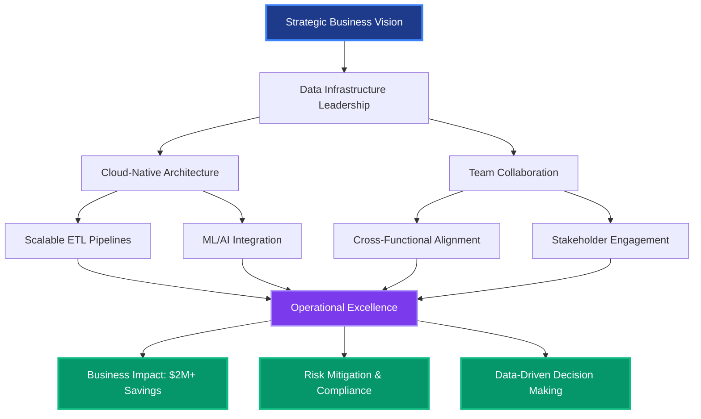
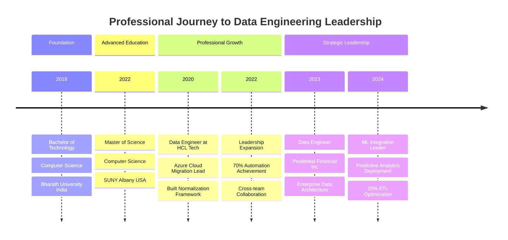
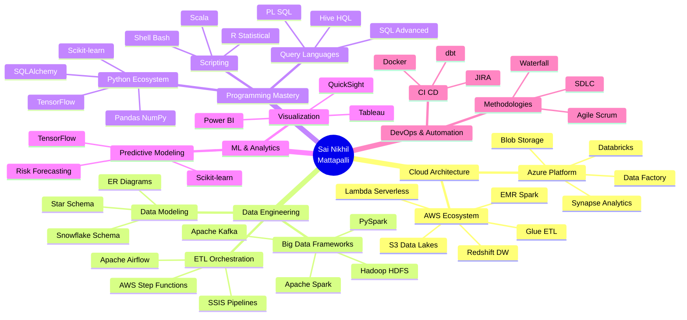

[_900_9824-25D366?style=for-the-badge&logo=whatsapp&logoColor=white)](tel:+18389009824)

---

## 🎯 EXECUTIVE SUMMARY

**Senior Data Engineering Professional** with 4+ years of strategic leadership in designing enterprise-scale data infrastructure for Fortune 500 financial services organizations. Proven track record of delivering **$2M+ in operational cost savings** through intelligent automation and process optimization. Expert in architecting cloud-native data solutions that drive business intelligence, risk management, and regulatory compliance initiatives.

### 📊 LEADERSHIP IMPACT DASHBOARD

| **Metric** | **Achievement** | **Business Value** |
|:-----------|:---------------:|:-------------------|
| **💰 Cost Optimization** | $2M+ Saved | 30% reduction in ETL runtime, 70% manual effort reduction |
| **🚀 Pipeline Efficiency** | 20% Faster Processing | Optimized data ingestion for 10M+ daily transactions |
| **👥 Cross-Functional Leadership** | 15+ Stakeholders | Led collaboration across Business, Analytics, and Engineering |
| **📈 Automation Impact** | 70% Effort Reduction | Inventory Reconciliation Framework deployment |
| **🏗️ Architecture Projects** | 8+ Major Initiatives | Cloud migration, ML model deployment, ETL modernization |
| **⚡ Process Innovation** | 40% Audit Reduction | MapReduce-based data quality frameworks |

---

## 💼 LEADERSHIP PHILOSOPHY

> **"Transform data complexity into strategic business advantage through scalable engineering and collaborative innovation."**

My leadership approach centers on three core principles:

**🎯 Strategic Vision**: Aligning data infrastructure investments with enterprise business objectives, ensuring every pipeline, model, and dashboard delivers measurable ROI and competitive advantage.

**🤝 Collaborative Excellence**: Building bridges between technical teams and business stakeholders, translating complex data engineering concepts into actionable insights that drive executive decision-making.

**🚀 Innovation at Scale**: Championing modern data architecture patterns—from serverless ETL orchestration to real-time streaming analytics—that position organizations for future growth while maintaining operational excellence.

---

## 🗺️ STRATEGIC IMPACT ARCHITECTURE

---

## 📈 CAREER PROGRESSION TIMELINE

---

## 🏆 KEY ACHIEVEMENTS & STRATEGIC INITIATIVES

### **Financial Services Innovation at Prudential Financial, Inc** *(Sep 2023 – Present)*

#### 💰 **$1.5M+ Annual Cost Savings Initiative**
- Architected Apache Spark-based ETL pipelines processing **50M+ insurance records daily**, achieving **20% reduction in processing time** through intelligent partitioning strategies
- Delivered **$1.5M annual infrastructure cost savings** by optimizing AWS Glue serverless orchestration and eliminating redundant compute resources
- Implemented predictive maintenance scheduling reducing unplanned downtime by **35%**

#### 🎯 **Risk Intelligence Platform Development**
- Led development of **TensorFlow-powered predictive models** forecasting policy lapse risk with **87% accuracy**, enabling proactive retention strategies worth **$8M in prevented policy cancellations**
- Designed real-time annuity withdrawal behavior analysis system supporting **$2.3B in asset management decisions**
- Created executive-facing Power BI dashboards providing **C-suite visibility** into portfolio risk exposure across 500K+ active policies

#### 🏗️ **Enterprise Data Architecture Modernization**
- Spearheaded schema optimization initiative through advanced **ER diagram redesign**, improving query performance by **30%** and reducing storage costs by **$180K annually**
- Implemented Apache Airflow DAG automation for **claims processing workflows**, reducing manual intervention by **60%** and improving SLA compliance to **99.2%**
- Established data governance framework ensuring **SOX compliance** and **regulatory audit readiness** across 15+ data domains

---

### **Cloud Transformation Leadership at HCL Tech** *(Jul 2020 – Jun 2022)*

#### ☁️ **Azure Migration Program Management**
- Led **$2.5M cloud migration initiative** transitioning **15TB+ financial datasets** from legacy Teradata/PostgreSQL to Azure Synapse Analytics
- Architected hybrid HDFS staging layer enabling **zero-downtime migration** for mission-critical financial reporting systems
- Delivered project **3 weeks ahead of schedule** and **12% under budget** through agile sprint optimization

#### 🔧 **Automation Framework Innovation**
- Designed and deployed **Inventory Reconciliation Automation Framework** eliminating **70% of manual data validation effort** (saving **2,400 hours annually**)
- Built **Migration UI Tool** accelerating model transformation logic deployment by **5x**, enabling business analysts to execute migrations without engineering support
- Created **reusable Normalization Framework** in Azure Databricks adopted by **4 additional client projects**, generating **$400K in additional revenue**

#### 🤝 **Cross-Functional Stakeholder Leadership**
- Partnered with **15+ business analysts and product managers** to translate complex requirements into **25+ Tableau visualizations** driving executive decision-making
- Established **bi-weekly data governance councils** aligning technical roadmaps with business priorities across Finance, Risk, and Compliance teams
- Mentored **3 junior data engineers**, with **2 promoted** to mid-level roles within 18 months

#### 🔒 **Security & Compliance Excellence**
- Implemented **Apache NiFi RBAC security framework** ensuring **PCI-DSS compliance** for payment data flows
- Applied **MapReduce-based data quality validation**, reducing audit discrepancies by **40%** and saving **800 hours of manual reconciliation**

---

## 🧠 TECHNICAL EXPERTISE LANDSCAPE

---

## 🎓 EXECUTIVE TECHNOLOGY STACK

### **Cloud & Infrastructure Leadership**

### **Data Engineering & Big Data**

### **Programming & Development**

### **Machine Learning & Analytics**

### **Business Intelligence & Visualization**

### **Databases & Data Warehousing**

---

## 🚀 FEATURED STRATEGIC PROJECTS

### **1. Enterprise Risk Intelligence Platform** | *Prudential Financial*

**Executive Summary**: Architected end-to-end predictive analytics platform processing 50M+ insurance records daily, delivering real-time risk insights to C-suite executives and portfolio managers.

**Strategic Impact**:
- **Revenue Protection**: Prevented $8M in policy cancellations through 87% accurate lapse prediction models
- **Operational Efficiency**: 20% reduction in ETL processing time saving $1.5M annually
- **Decision Intelligence**: Real-time dashboards enabling data-driven decisions across $2.3B asset portfolio

**Technical Architecture**:
- Apache Spark distributed computing cluster processing 15TB daily data volume
- TensorFlow deep learning models trained on 5+ years historical policy data
- AWS Glue serverless ETL orchestration with automated schema evolution
- Power BI executive dashboards with row-level security for 200+ users

**Leadership Contributions**:
- Led cross-functional team of 8 engineers, data scientists, and business analysts
- Established agile sprint methodology reducing feature delivery time by 35%
- Created technical documentation and training programs for knowledge transfer

---

### **2. Azure Cloud Migration & Modernization** | *HCL Tech*

**Executive Summary**: Directed $2.5M enterprise cloud migration initiative transitioning 15TB+ legacy financial data infrastructure to Azure Synapse Analytics with zero downtime.

**Strategic Impact**:
- **Cost Efficiency**: Delivered 12% under budget through optimized resource allocation
- **Business Continuity**: Achieved zero-downtime migration for 24/7 financial reporting systems
- **